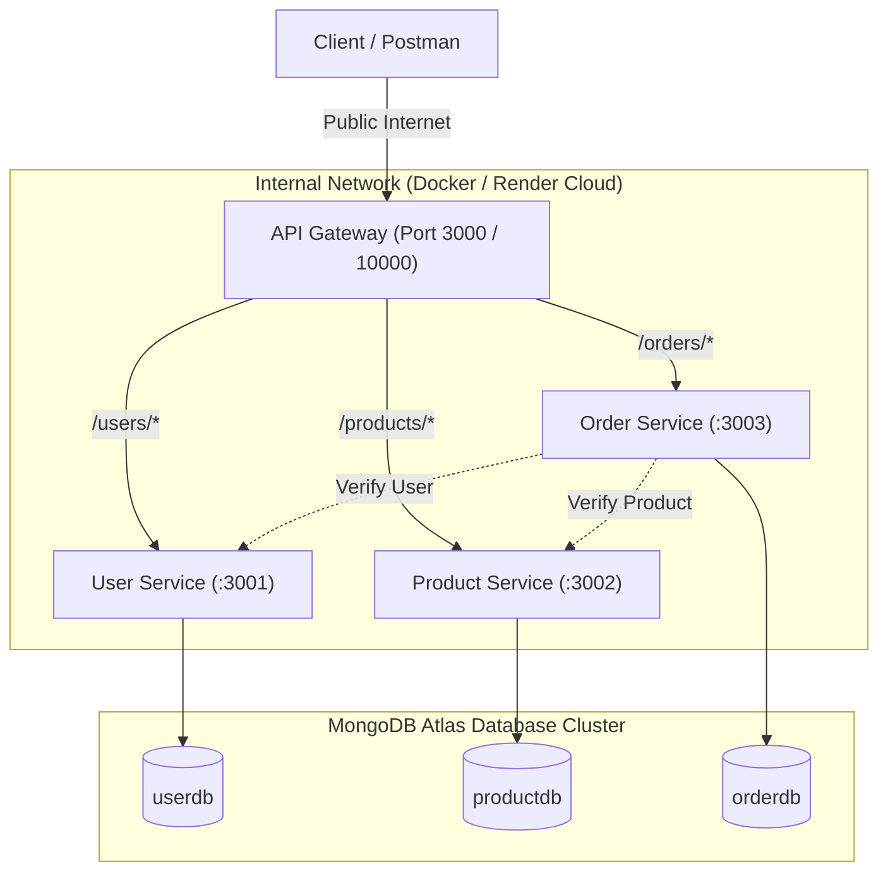

# LAB 7 – API Gateway, Service Discovery & Cloud Deployment

## 1. Objective

The objective of Lab 7 is to evolve the containerized microservices architecture built in Lab 6 into a production-grade, cloud-deployed system:
1. **API Gateway**: Build and deploy an API Gateway as the single public entry point for all client requests, hiding internal microservice topology, centralizing cross-cutting concerns (logging, error handling), and isolating backend services inside private networks.
2. **Service Discovery (Configuration-Based)**: Decouple service locations from routing code using externalized configuration and environment variables, enabling location updates without code changes.
3. **Cloud Deployment**: Containerize and deploy the entire multi-service system (`api-gateway`, `user-service`, `product-service`, `order-service`, backed by **MongoDB Atlas**) to a public cloud platform (**Render**), making the system accessible over the public internet.

---

## 2. Microservices Architecture & Flow

### Full-Stack Request Flow:
```text
Client / Postman
       │
       ▼ (Public HTTPS)
┌────────────────────────────────────────────────────────┐
│             API Gateway (Port 3000 / 10000)            │
│  - Single Public Entry Point                           │
│  - Request Logging & Metrics                           │
│  - 502/503 Centralized Failure Handling               │
│  - Service Discovery / Config-Driven Routing           │
└──────┬──────────────────┬───────────────────┬──────────┘
       │                  │                   │
       ▼                  ▼                   ▼
┌──────────────┐   ┌──────────────┐   ┌──────────────┐
│ User Service │   │Product Serv. │   │ Order Service│
│ (Port 3001)  │   │ (Port 3002)  │   │ (Port 3003)  │
└──────┬───────┘   └──────┬───────┘   └───────┬──────┘
       │                  │                   │
       │                  │        Calls GET /users/{id}
       │                  │◄────── & GET /products/{id}
       ▼                  ▼                   ▼
┌──────────────┐   ┌──────────────┐   ┌──────────────┐
│ MongoDB Atlas│   │ MongoDB Atlas│   │ MongoDB Atlas│
│   (userdb)   │   │  (productdb) │   │   (orderdb)  │
└──────────────┘   └──────────────┘   └──────────────┘
```

### Mermaid Architecture Diagram:


---

## 3. Discussion Questions

### Question 1: Why introduce an API Gateway instead of letting clients call each service directly?
- **Single Entry Point**: Clients interact with a single stable domain/hostname, shielding them from backend microservice fragmentation, port proliferation, and service boundary refactoring.
- **Hiding Internal Architecture & Security**: Backend microservices (`user-service`, `product-service`, `order-service`) remain completely hidden within a private network with no public ports exposed. Only the gateway faces the internet.
- **Centralized Cross-Cutting Concerns**: Authentication, SSL/TLS termination, rate limiting, request tracing/logging, and health audits are handled uniformly at the gateway rather than duplicated in each service.
- **Resilience & Centralized Error Handling**: Unreachable or failing downstream microservices are caught by the gateway and returned as clean, standard `502 Bad Gateway` or `503 Service Unavailable` JSON responses, preventing client connection hangs or timeouts.

### Question 2: Static / Config-Based Discovery vs. Dynamic Service Discovery
- **Static / Config-Based Approach (This Lab)**:
  - Service URLs are injected as environment variables (`USER_SERVICE_URL`, `PRODUCT_SERVICE_URL`, `ORDER_SERVICE_URL`).
  - *Pros*: Simple, deterministic, zero third-party dependencies, perfectly suited for container orchestration and fixed cloud endpoints.
  - *Cons*: Modifying a service location or scaling horizontally requires updating the configuration and restarting/redeploying the gateway container.
- **Dynamic Service Discovery (e.g., Netflix Eureka, HashiCorp Consul, Kubernetes DNS)**:
  - *What Dynamic Registries Add*:
    - **Self-Registration & Heartbeats**: Instances automatically register their IP/port on boot and send periodic heartbeats. When an instance dies, the registry automatically de-registers it.
    - **Automatic Client-Side Load Balancing**: The gateway or client queries the registry and distributes traffic across multiple dynamic replicas (round-robin, least-connections) without manual configuration.
    - **Elastic Autoscaling**: Instances can scale from 1 to 50 dynamically in response to traffic surges, and the gateway immediately routes to all new replicas with zero downtime or config changes.

---

## 4. API Endpoints & Gateway Routing Table

| Gateway Path | Routed Service | Target Default Port | Description |
|---|---|---|---|
| `GET /health` | API Gateway itself | - | Health check (`{"status":"UP","service":"api-gateway"}`) |
| `GET /users` | User Service | `3001` | Retrieve all users |
| `GET /users/{id}` | User Service | `3001` | Retrieve user by ID |
| `POST /users` | User Service | `3001` | Create a new user |
| `PUT /users/{id}` | User Service | `3001` | Update user by ID |
| `DELETE /users/{id}` | User Service | `3001` | Delete user by ID |
| `GET /products` | Product Service | `3002` | Retrieve all products |
| `GET /products/{id}` | Product Service | `3002` | Retrieve product by ID |
| `POST /products` | Product Service | `3002` | Create a new product |
| `PUT /products/{id}` | Product Service | `3002` | Update product by ID |
| `DELETE /products/{id}` | Product Service | `3002` | Delete product by ID |
| `GET /orders` | Order Service | `3003` | Retrieve all orders |
| `GET /orders/{id}` | Order Service | `3003` | Retrieve order by ID |
| `POST /orders` | Order Service | `3003` | Create order (validates user & product first) |

---

## 5. Cloud Deployment (Render & MongoDB Atlas)

The entire microservices system is deployed and operating live in the cloud.

### Live Cloud Endpoints:
- **API Gateway (Public Client Entry Point)**: `https://api-gateway-qtl3.onrender.com`
- **User Service**: `https://user-service-cj1k.onrender.com`
- **Product Service**: `https://product-service-mlkw.onrender.com`
- **Order Service**: `https://order-service-8czg.onrender.com`
- **Database**: Cloud-hosted MongoDB Atlas Cluster (`campusconnectcluster.a0ey7mr.mongodb.net`) with isolated databases: `userdb`, `productdb`, `orderdb`.

### Cloud Configuration (Environment Variables):
- **API Gateway**:
  - `GATEWAY_PORT`: `10000`
  - `USER_SERVICE_URL`: `https://user-service-cj1k.onrender.com`
  - `PRODUCT_SERVICE_URL`: `https://product-service-mlkw.onrender.com`
  - `ORDER_SERVICE_URL`: `https://order-service-8czg.onrender.com`
- **User Service**:
  - `USER_SERVICE_PORT`: `10000`
  - `MONGO_DATABASE`: `userdb`
  - `MONGO_URI`: `mongodb+srv://<user>:<password>@campusconnectcluster.a0ey7mr.mongodb.net/?retryWrites=true&w=majority`
- **Product Service**:
  - `PRODUCT_SERVICE_PORT`: `10000`
  - `MONGO_DATABASE`: `productdb`
  - `MONGO_URI`: `mongodb+srv://<user>:<password>@campusconnectcluster.a0ey7mr.mongodb.net/?retryWrites=true&w=majority`
- **Order Service**:
  - `ORDER_SERVICE_PORT`: `10000`
  - `MONGO_DATABASE`: `orderdb`
  - `MONGO_URI`: `mongodb+srv://<user>:<password>@campusconnectcluster.a0ey7mr.mongodb.net/?retryWrites=true&w=majority`
  - `USER_SERVICE_URL`: `https://user-service-cj1k.onrender.com`
  - `PRODUCT_SERVICE_URL`: `https://product-service-mlkw.onrender.com`

---

## 6. Local Execution via Docker Compose

In `docker-compose.yml`, only the `api-gateway` exposes an external port (`3000:3000`). The backend services (`user-service`, `product-service`, `order-service`) expose NO host ports, ensuring network isolation.

```bash
# Start all services with the API Gateway
docker compose up -d

# Check running containers
docker compose ps

# Access health check
curl http://localhost:3000/health

# Access services through the Gateway
curl http://localhost:3000/users
curl http://localhost:3000/products
curl http://localhost:3000/orders
```

---

## 7. Troubleshooting Notes

1. **Spring Boot 4 MongoDB Property Key**:
   - In Spring Boot 4.x, the property is `spring.mongodb.uri` (alongside `spring.mongodb.database`), whereas Spring Boot 3 used `spring.data.mongodb.uri`. Both were configured to guarantee seamless connection resolution.
2. **Render Docker Context Resolution**:
   - When deploying microservices from a monorepo on Render, setting both Root Directory and Dockerfile Path can lead to duplicated paths (e.g. `product-service/product-service`). Leaving **Root Directory empty**, setting **Dockerfile Path** to `./<service>/Dockerfile`, and specifying **Docker Build Context Directory** as `./<service>` guarantees clean Maven builds.
3. **Render Free Tier Spin-Down / Cold Starts**:
   - Inactive instances spin down after 15 minutes of idle time. The initial cold start takes ~40–50 seconds for JVM startup. Once active, inter-service calls respond in sub-second latency.
4. **Centralized 502/503 Proxy Resiliency**:
   - The Gateway includes an error hook (`proxyErrorHandler`) in `server.js` that catches downstream socket timeouts and connection drops, returning clean `503 Service Unavailable` JSON instead of hanging client connections.

---

## 8. Reflection

Moving from Lab 6 to Lab 7 fundamentally shifted how the microservices system is operated and consumed. In Lab 6, clients had to track individual service ports (`:3001`, `:3002`, `:3003`) on `localhost`, exposing internal topology and requiring direct access to every service. With the API Gateway introduced in Lab 7, the entire system is accessed through a single unified endpoint with centralized logging and resilient error handling, while backend services are safely isolated behind private networking. Furthermore, deploying to Render and MongoDB Atlas transitioned the application from local development to a globally accessible cloud architecture, proving that externalized configuration allows microservices to move seamlessly between Docker networks and public cloud environments without modifying a single line of business code.
